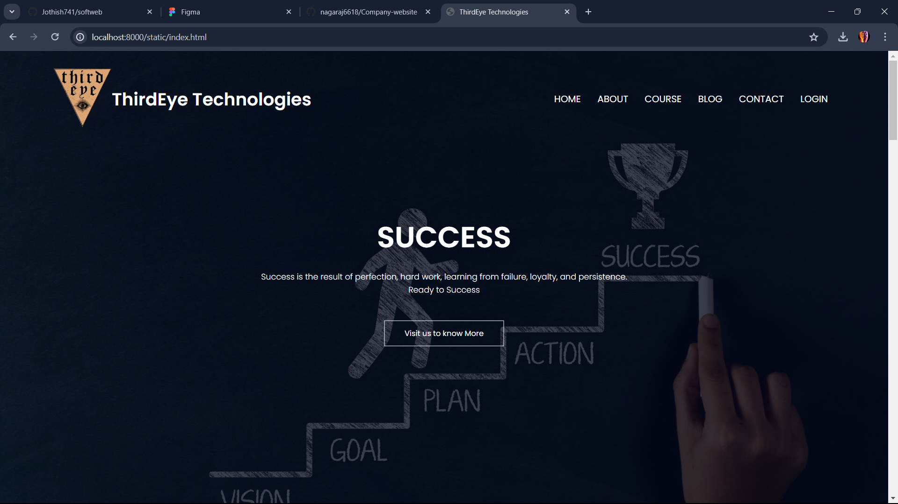
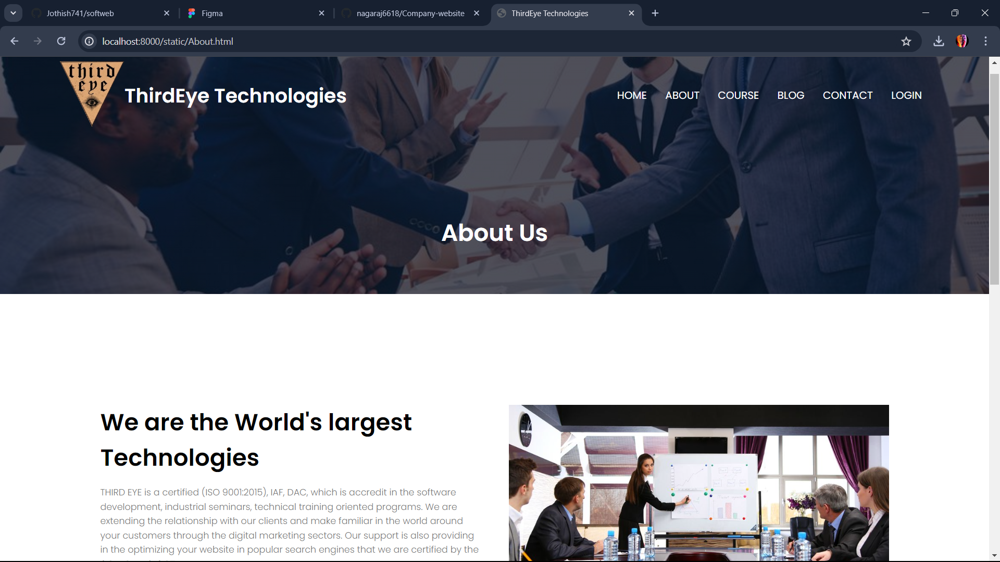
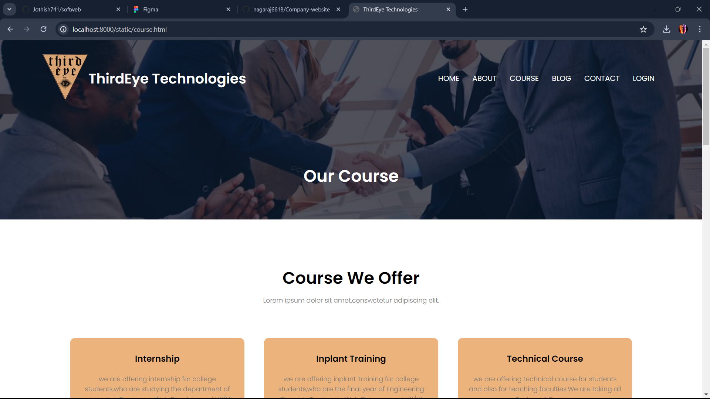

# Ex.07 Software Product Company Website
## Date:

## AIM:
To develop a static company website to display the softwares and services provided by the company.

## DESIGN STEPS:

### Step 1:
Requirement collection.

### Step 2:
Creating the layout using HTML and CSS.

### Step 3:
Updating the sample content.

### Step 4:
Choose the appropriate style and color scheme.

### Step 5:
Validate the layout in various browsers.

### Step 6:
Validate the HTML code.

### Step 7:
Publish the website in the given URL.

## PROGRAM:
```html
<!DOCTYPE html>
<html>
  <head>
    <meta name="view" content="with=device-width, initial-scale=1.0">
    <title>ThirdEye Technologies</title>
    <link rel="stylesheet" href="style.css">
    <link rel="preconnect" href="https://fonts.googleapis.com">
<link rel="preconnect" href="https://fonts.gstatic.com" crossorigin>
<link href="https://fonts.googleapis.com/css2?family=Poppins:wght@100;300;400;600;700&display=swap" rel="stylesheet">

<link rel="stylesheet" href="https://cdn.jsdelivr.net/npm/@fortawesome/fontawesome-free@6.2.1/css/fontawesome.min.css">
<link rel="stylesheet" href="https://cdnjs.cloudflare.com/ajax/libs/font-awesome/4.7.0/css/font-awesome.min.css">
</head>
  <body>
    <section class="header">
      <nav>
        <a href="index.html"> </a>
        <h3 class="com-name">ThirdEye Technologies</h3>
       
        <div class="nav-links" id="navLinks">
          <i class="fa fa-times" onclick="hideMenu()"></i>
          <ul>
            <li><a href="index.html">HOME</a></li>
            <li><a href="About.html">ABOUT</a></li>
            <li><a href="course.html">COURSE</a></li>
            <li><a href="blog.html">BLOG</a></li>
            <li><a href="contact.html">CONTACT</a></li>
            <li><a href="login.html">LOGIN</a></li>
          </ul>
        </div>
        
        <i class="fa fa-bars" aria-hidden="true" onclick="showMenu()"></i>
      </nav>
      
    <div class="text-box">
      <h1>SUCCESS</h1>
      <p>Success is the result of perfection, hard work, learning from failure, loyalty, and persistence.<br> Ready to Success
      </p>
      <a href="About.html" class="hero-btn">Visit us to know More</a>
    </div>
    </section>
<!--COURSE-->
<section class="course">
  <h1>Course We Offer</h1>
  <p>Lorem ipsum dolor sit amet,conswctetur adipiscing elit.</p>

  <div class="row">
    <div class="course-col">
      <h3>Internship</h3>
      <p>we are offering internship for college students,who are studying the department of computers.Topics are Web Development,UX/UI animation design,Data Analyst,Cyber Security and other technical course</p>

    </div>
    <div class="course-col">
      <h3>Inplant Training</h3>
      <p>we are offering inplant Training for college students,who are the final year of Engineering Students.Topics are Web Development,UX/UI animation design,Data Analyst,Cyber Security and other technical course</p>
      
    </div>
    <div class="course-col">
      <h3>Technical Course</h3>
      <p>we are offering technical course for students and also for teaching faculties.We are taking all Technical Courses </p>
      
    </div>
  </div>
</section>
  </body>
</html>


```

## OUTPUT:




## RESULT:
The program for designing software company website using HTML and CSS is completed successfully.
